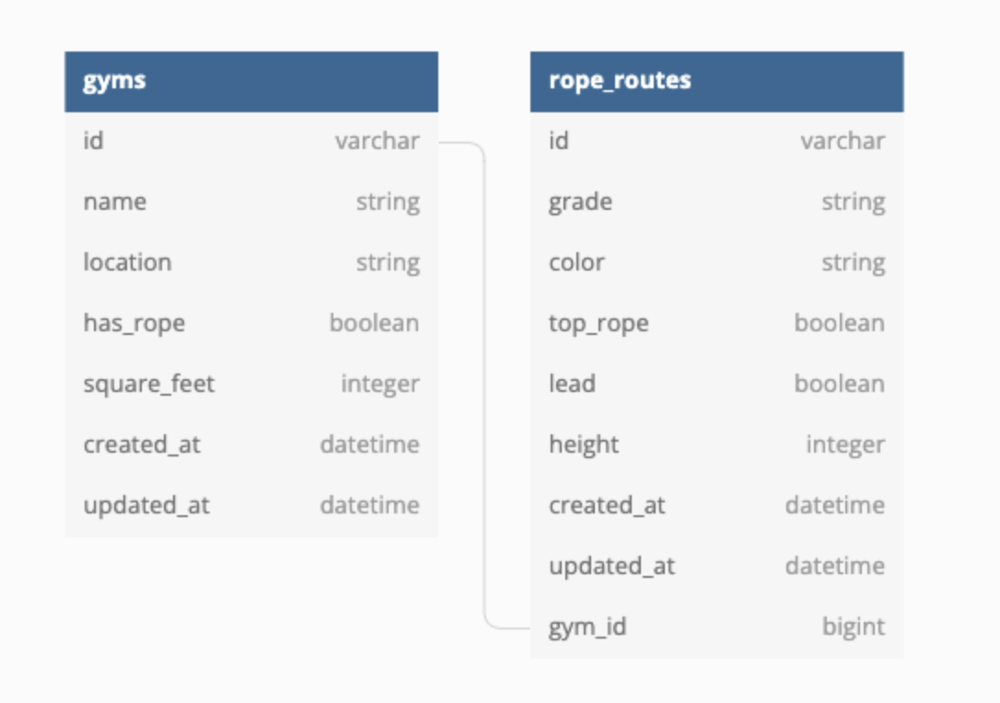

# README

Alt-Turing School Module 2, Solo Project: Relational Rails
======
By: Zachary Hazelwood

> Ruby Version: 2.7.4
> Rails: 5.2.6

This project is created with the goal of understanding One to Many database associations, as well as utilizing proper CRUD procedures when creating an application. It also includes class and instance methods that apply specific parameters for ActiveRecord and SQL queries.

Above is a representation of each table and their associations, created via the app's `schema.rb`.
